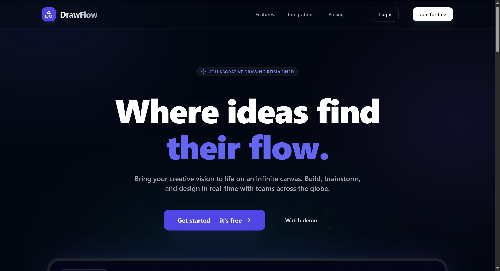
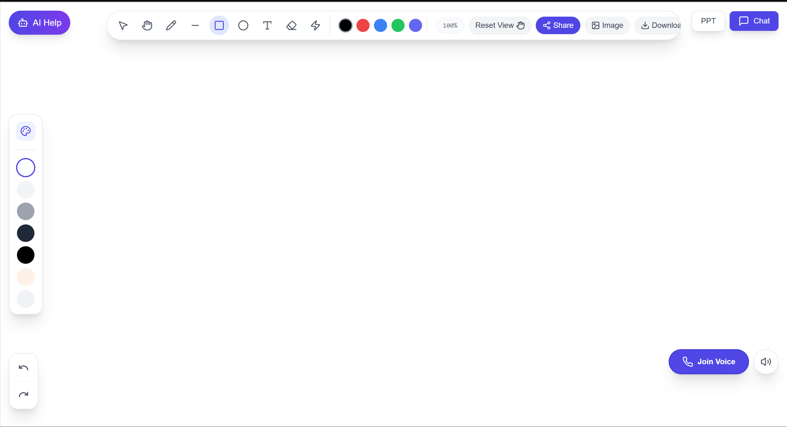

# QuickDraw 🎨 ⚡

QuickDraw is a high-performance, real-time collaborative whiteboarding application. Built with a modern monorepo architecture, it enables seamless stroke synchronization with ultra-low latency, AI-powered design assistance, and robust room-based collaboration.

### 📖 [**How to Use QuickDraw (Usage Guide)**](USAGE.md)




---

## 🚀 Features

- **Real-Time Collaboration**: Real-time drawing sync (approx. 50ms latency) using WebSockets.
- **Private Drawing Rooms**: Create and join unique rooms for focused group brainstorming.
- **AI Integration**: Built-in AI chat powered by Groq (Llama 3.3) to help generate ideas or design structures.
- **PPT Export**: Export your whiteboard designs directly to PowerPoint presentations.
- **Modern Auth**: Secure user management and authentication powered by Clerk.
- **Responsive Design**: Fluid, high-performance UI built with Next.js 15 and Tailwind CSS.
- **Monorepo Architecture**: Efficient code sharing and task orchestration using TurboRepo.

---



## 🛠️ Tech Stack

### Frontend
- **Next.js 15**: App Router, Server Components.
- **Tailwind CSS**: Modern UI styling.
- **Lucide React**: Beautiful iconography.
- **Framer Motion**: Smooth micro-animations.
- **Clerk**: Authentication & User Management.

### Backend
- **Node.js & Express**: Scalable HTTP REST API.
- **WS (WebSocket)**: High-speed bi-directional communication.
- **Prisma**: Type-safe ORM for PostgreSQL.
- **Groq API**: High-speed AI inference for collaborative chat.
- **PptxGenJS**: Dynamic PowerPoint generation.

### Tooling
- **TurboRepo**: High-performance build system for monorepos.
- **pnpm**: Fast, disk space efficient package management.
- **Docker**: (Optional) For consistent database environments.

---

## 📂 Project Structure

```text
QuickDraw/
├── apps/
│   ├── excelidraw-frontend/ # Main drawing application (Client)
│   ├── http-backend/         # REST API for users, rooms, and AI
│   ├── ws-backend/           # WebSocket server for stroke sync
│   └── web/                  # Landing page and secondary components
├── packages/
│   ├── db/                   # Prisma schema and shared DB client
│   ├── common/               # Shared Zod schemas and TypeScript types
│   ├── ui/                   # Shared React component library
│   └── typescript-config/     # Base TS configurations
├── turbo.json                # Turbo orchestrator configuration
└── pnpm-workspace.yaml       # pnpm workspace definition
```

---

## ⚙️ Local Setup

### Prerequisites
- Node.js (v20+ or v22+)
- pnpm (`npm install -g pnpm`)
- PostgreSQL database (or a hosted service like Supabase/Neon)

### 1. Clone the Repository
```bash
git clone https://github.com/rajputdivyanshu81/QuickDraw.git
cd QuickDraw
```

### 2. Install Dependencies
```bash
pnpm install
```

### 3. Environment Variables
Create `.env` files in the relevant directories based on the provided examples:

#### `apps/excelidraw-frontend/.env`
```env
NEXT_PUBLIC_CLERK_PUBLISHABLE_KEY=your_clerk_pub_key
CLERK_SECRET_KEY=your_clerk_secret_key
NEXT_PUBLIC_CLERK_SIGN_IN_URL=/signin
NEXT_PUBLIC_CLERK_SIGN_UP_URL=/signup
NEXT_PUBLIC_HTTP_BACKEND=http://localhost:3001
NEXT_PUBLIC_WS_URL=ws://localhost:8080
```

#### `apps/http-backend/.env`
```env
DATABASE_URL=your_postgres_url
CLERK_SECRET_KEY=your_clerk_secret_key
GROQ_API_KEY=your_groq_api_key
FRONTEND_URL=http://localhost:3000
```

### 4. Database Setup
```bash
# Generate the Prisma client
pnpm run db:generate

# Push the schema to your database
cd packages/db
npx prisma db push
```

### 5. Run the Application
From the root directory:
```bash
pnpm dev
```
- **Frontend**: [http://localhost:3000](http://localhost:3000)
- **HTTP Backend**: [http://localhost:3001](http://localhost:3001)
- **WS Backend**: `ws://localhost:8080`

---

## 🎨 Deployment

### Frontend (Vercel)
The Next.js app is optimized for Vercel. Ensure all `NEXT_PUBLIC_` variables are set in the Vercel Dashboard.

### Backend (Render/Railway)
The backends are configured to listen on a dynamic port (`process.env.PORT`) for easy deployment to services like Render or Railway. Use the provided `render.yaml` for a quick setup.

---

## 🤝 Contributing
Contributions are welcome! Please feel free to submit a Pull Request.

1. Fork the Project.
2. Create your Feature Branch (`git checkout -b feature/AmazingFeature`).
3. Commit your Changes (`git commit -m 'Add some AmazingFeature'`).
4. Push to the Branch (`git push origin feature/AmazingFeature`).
5. Open a Pull Request.

---

## 📄 License
Distributed under the MIT License. See `LICENSE` for more information.

---
Created by [Divyanshu Rajput](https://github.com/rajputdivyanshu81)
