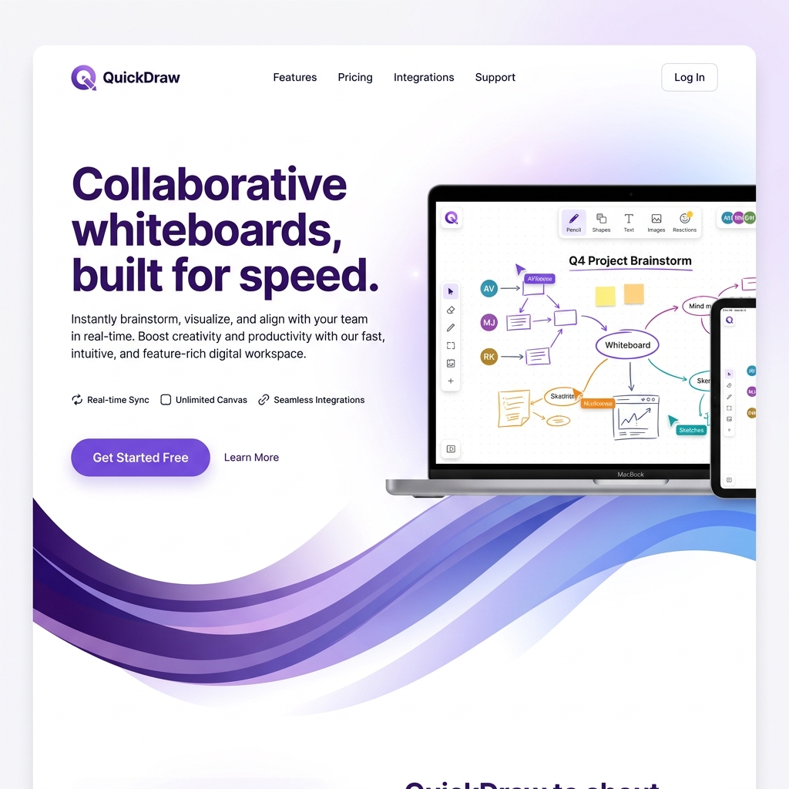
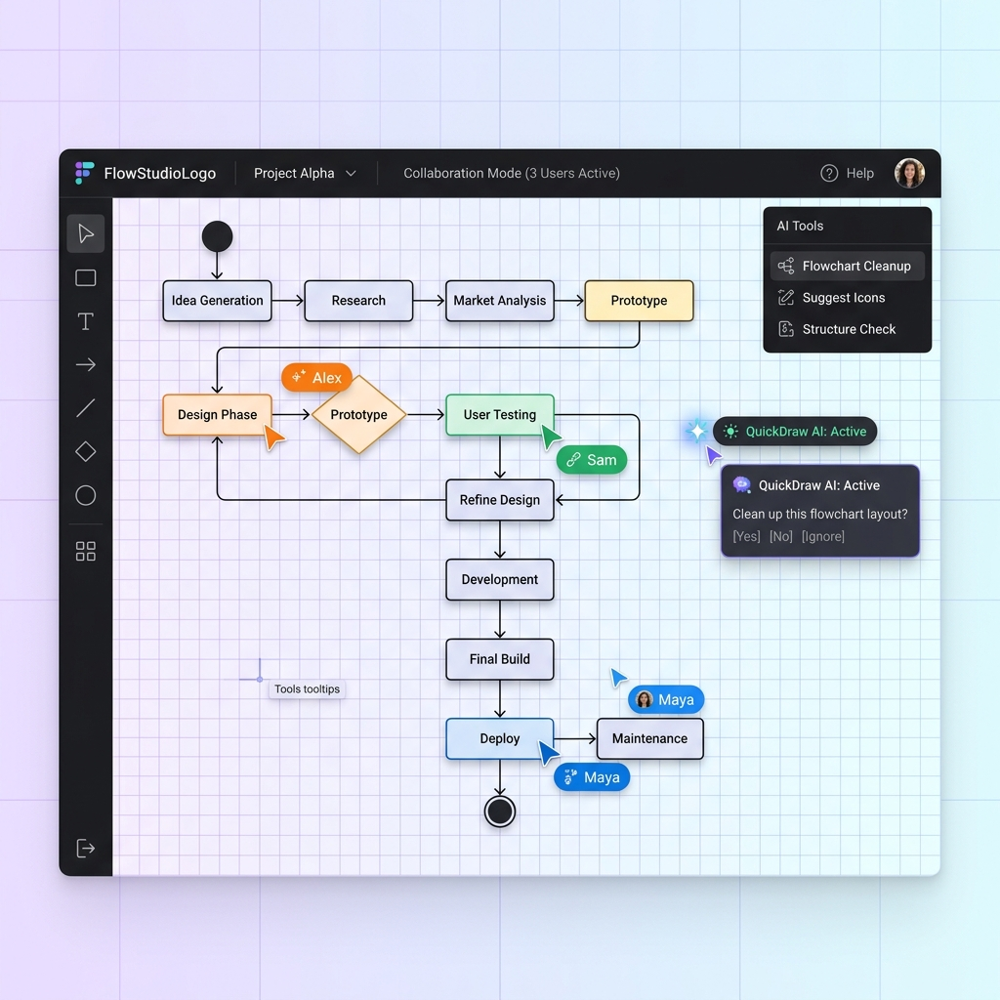
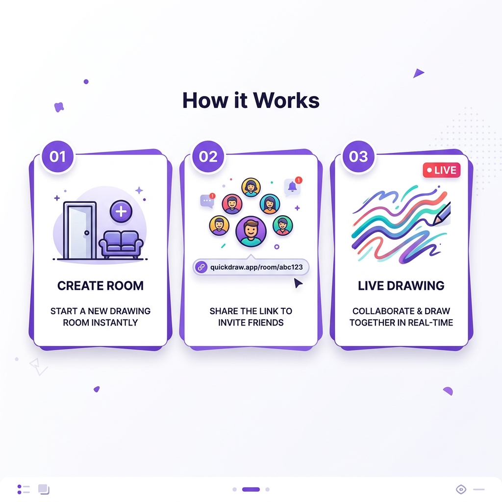

[](https://github.com/rajputdivyanshu81/QuickDraw/actions/workflows/ci.yml)
[](https://opensource.org/licenses/MIT)
[](https://github.com/rajputdivyanshu81/QuickDraw/discussions)
[](https://github.com/rajputdivyanshu81/QuickDraw/graphs/contributors)

# QuickDraw 🎨 ⚡

[](https://github.com/rajputdivyanshu81/QuickDraw/actions/workflows/ci.yml)
[](https://opensource.org/licenses/MIT)

QuickDraw is a high-performance, real-time collaborative whiteboarding application. Built with a modern monorepo architecture, it enables seamless stroke synchronization with ultra-low latency, AI-powered design assistance, and robust room-based collaboration.



### 📖 Resources
- [**Usage Guide**](USAGE.md) - How to get the most out of QuickDraw.
- [**Contributing Guide**](CONTRIBUTING.md) - How to set up locally and contribute code.
- [**Discussions**](https://github.com/rajputdivyanshu81/QuickDraw/discussions) - Connect with the community and share ideas.

---

## 🚀 Features

- **Real-Time Collaboration**: Stroke synchronization (approx. 50ms latency) using WebSockets.
- **AI Integration**: Built-in AI chat powered by Groq (Llama 3.3) for design assistance.
- **Private Drawing Rooms**: Create and join unique rooms for focused group brainstorming.



- **PPT Export**: Export your whiteboard designs directly to PowerPoint presentations.
- **Modern Auth**: Secure user management and authentication powered by Clerk.
- **Responsive UI**: High-performance interface built with Next.js 15 and Tailwind CSS.
- **Monorepo Architecture**: Efficient code sharing and task orchestration via TurboRepo.

---

## 🛠️ Tech Stack

- **Frontend**: Next.js 15 (App Router), Tailwind CSS, Framer Motion, Lucide React.
- **Backend**: Node.js, Express, WS (WebSocket).
- **Database**: PostgreSQL with Prisma ORM.
- **AI**: Groq API (Llama 3.3).
- **Tooling**: TurboRepo, pnpm, Docker.

---

## ⚙️ How it Works



Detailed instructions are available in the [**Contributing Guide**](CONTRIBUTING.md).

```bash
# 1. Install dependencies
pnpm install

# 2. Setup database
pnpm db:generate

# 3. Start development
pnpm dev
```

## 📂 Project Structure

```text
QuickDraw/
├── apps/
│   ├── excelidraw-frontend/ # Main drawing application (Client)
│   ├── http-backend/         # REST API for users, rooms, and AI
│   ├── ws-backend/           # WebSocket server for stroke sync
│   └── web/                  # Landing page and secondary components
├── packages/
│   ├── db/                   # Prisma schema and shared DB client
│   ├── common/               # Shared Zod schemas and TypeScript types
│   ├── ui/                   # Shared React component library
│   └── eslint-config/        # Shared ESLint configurations
```

## 🤝 Contributing

Contributions make the community an amazing place to learn and create. Please read our [**Contributing Guide**](CONTRIBUTING.md) to get started.

## 📄 License

Distributed under the MIT License. See `LICENSE` for more information.

---
Created by [Divyanshu Rajput](https://github.com/rajputdivyanshu81)


