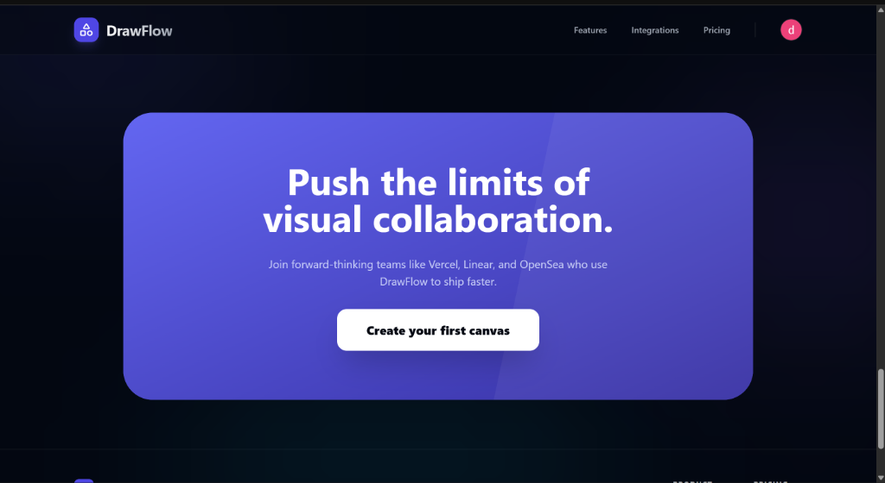
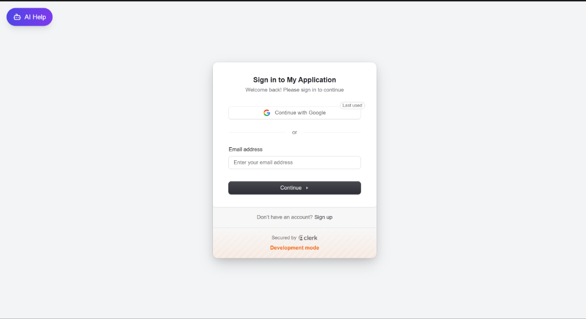
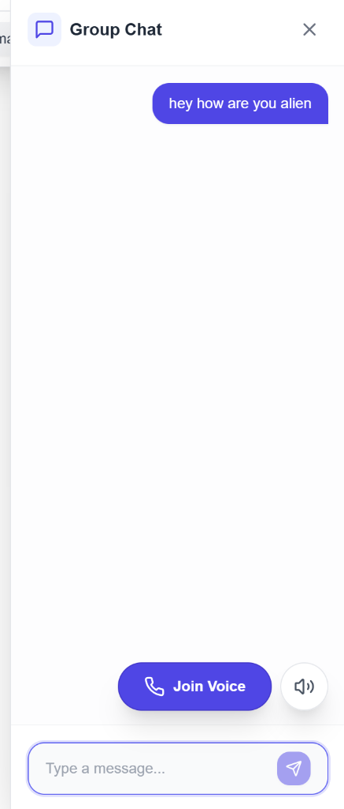
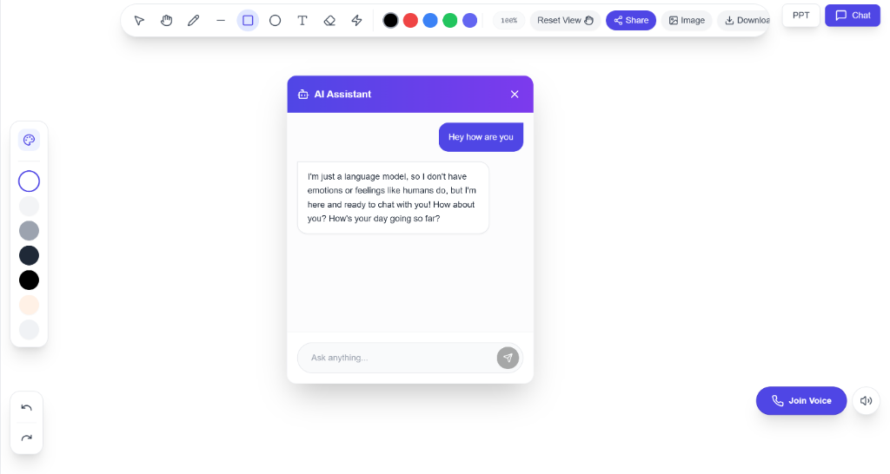
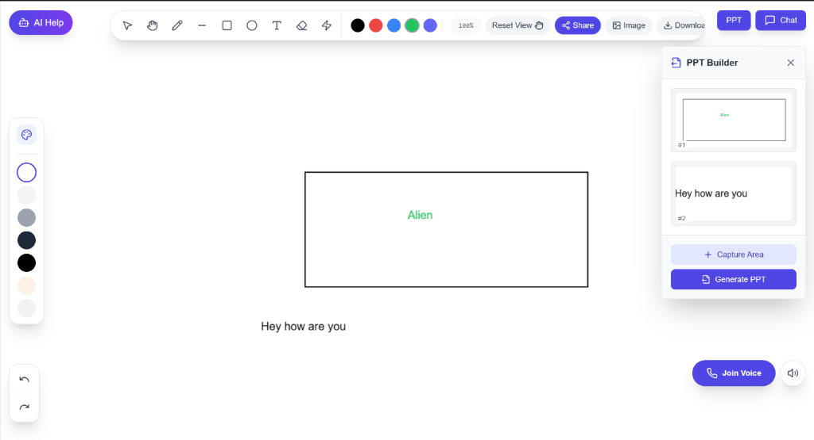

# How to Use QuickDraw 🎨 ⚡

Welcome to the QuickDraw usage guide! This document explains how to get the most out of your collaborative drawing experience with visual step-by-step instructions.

---

## 🚀 Quick Start

### 1. Welcome to DrawFlow
Our landing page is designed to get you drawing in seconds. Click **"Create your first canvas"** to begin.

### 2. Sign Up/Sign In
We use secure Clerk authentication. You can sign in with your email or use social providers like Google for instant access.

### 3. Start Drawing
Once inside a room, use the intuitive canvas tools at the top to sketch, write, or diagram. Your changes are synchronized instantly with everyone in the room.

---

## 🎨 Core Features in Depth

### 1. Real-Time Collaborative Drawing & Chat
Every stroke is broadcast in under 50ms. You can also use the **Group Chat** sidebar to coordinate with your team without leaving the canvas.

### 2. AI Drawing Assistant
QuickDraw isn't just a whiteboard; it's an AI-powered brainstorming tool.
- **How to use**: Click the **AI Assistant** icon to open the chat sidebar.
- **Capabilities**: Ask the AI (powered by Llama 3.3) to plan layouts, suggest ideas, or refine your workflow.

### 3. PowerPoint (PPT) Export
Turn your whiteboard diagrams into professional presentations instantly.
- **How to use**: Click the **"PPT"** button to open the PPT Builder.
- **Capture Area**: Select the canvas areas you want as slides and click **"Generate PPT"**.

---

## 🛠️ Advanced Tools

### Room Management
- **Persistent States**: Your drawings are saved automatically to our robust database, ensuring your progress is never lost.
- **Voice Collaboration**: Join the voice channel for high-bandwidth collaboration during live sessions.

---

## 💡 Best Practices

- **Descriptive Rooms**: Name your rooms based on projects (e.g., "Project-Alpha-Sprint-1").
- **AI-Guided Structures**: Ask the AI for a "Sitemap structure" or "Flowchart logic" and use it as a reference while you draw.
- **Layering**: Use different shapes and colors to signify different parts of your system architecture.

---

## ❓ Troubleshooting

- **WebSocket Errors**: If you see a connection error, ensure your Vercel/Render environment variables are correctly synchronized (refer to the main README).
- **Export Issues**: Ensure your browser permissions allow downloads to receive your `.pptx` file.

---
*Ready to build something amazing? Start drawing now!*
